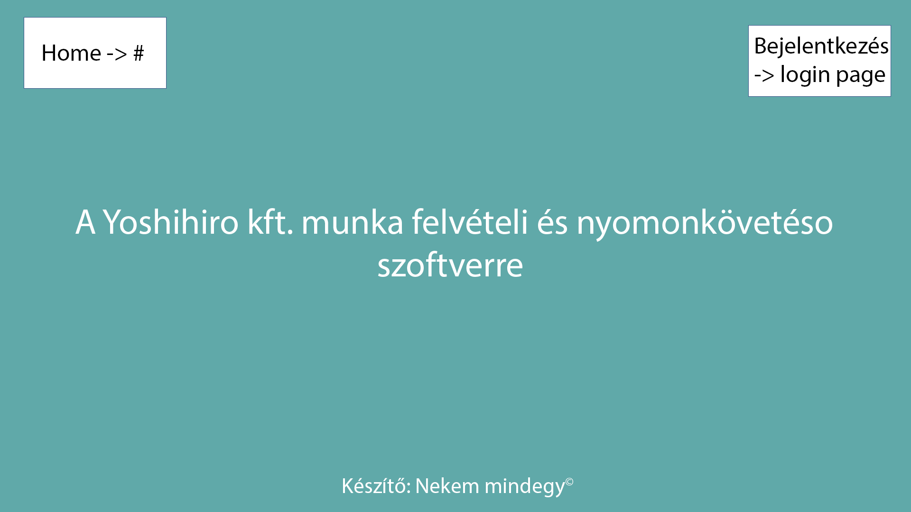
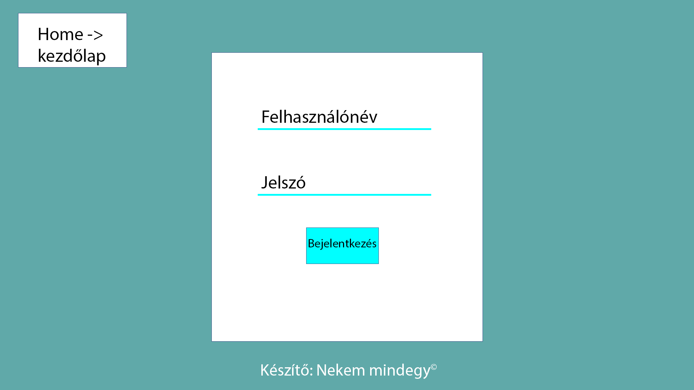
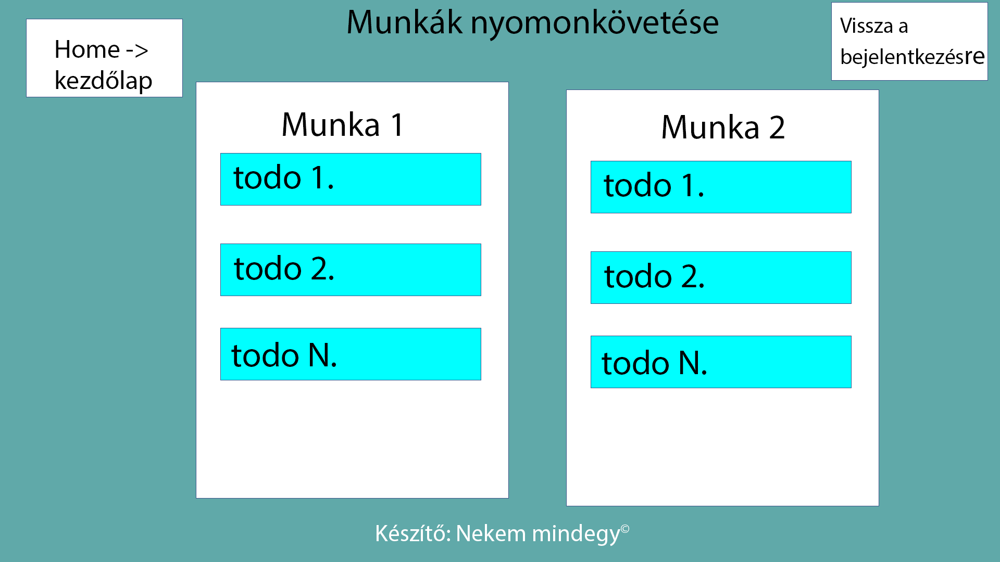

# Funkcionális specifikáció

## 1.	Áttekintés:
Cégünk, a Yoshihiro Kft. célja az elektromos kerékpárok népszerűsítése országszerte. Hagyományos kerékpárok elektromossá való átalakítására specializálódtunk már évek óta.  Visszatérő és leendő vásárlóink pozitív visszajelzéseit szeretnénk fenntartani, ezért újításokat tervezünk bevezetni működésünkben. Nagy fejlesztéseken megyünk át, melynek részeként szeretnénk egy olyan letisztult, bárhonnan elérhető felületet létrehozni, amely megkönnyíti és felgyorsítja alkalmazottjaink és munkatársaink feladatait.

## 2.	Jelenlegi helyzet:
Az évek során jól megszokott praktikák és az általunk használt rendszerek sajnos elavultak. Mivel cégünk jeligéje az innováció, ezért úgy gondoljuk egy fejlett szoftver használata kulcsfontosságú lehet a további működésünkben. Jelenleg a munkafolyamatok és azok állapota egy jegyzettömbben van vezetve, ami közel sem ideális. Nehezen átlátható, hogy éppen melyik munka milyen fázisban van, illetve az, hogy mennyi teendőnk van adott kerékpárokkal. Ez a szoros határidőkkel párosulva megterhelő és időnként stresszes lehet csapatunk számara.  Munkatársainknak egy egyszerű és problémamentes légkört tervezünk kialakítani az eredményes feladatvégzéshez.

## 3.	Követelménylista:
	
|K1|
Letisztult rendszer
|
Könnyen átlátható és értelmezhető felület a gyors munkavégzés elősegítéséhez
|
|K2|Reszponzív webdizájn|Optimális megjelenítés a felhasználó által kezelt különböző eszközökön|
|K3|Mobilon is elérhető|Telefonnal is egy kattintásra elérhető adatok|
|K4|Hatékony működés|Hibamentes és pontos értékek reprezentálása, gyors üzemelés|
|K5|Platformfüggetlenség|Mindenki számára elérhető, felülettől független alkalmazhatóság|

## 4.	Jelenlegi üzleti folyamatok modellje:
A megrendelő megkeres minket személyesen az üzletünkben, telefonon vagy e-mailben és tájékoztat minket az elvégzendő munkáról. Feljegyezzük a feladatokat egy jegyzettömbbe, majd az adott időben szabad kapacitással rendelkező kollegánkat értesítjük a teendőkről. Ezután a raktárunkban ellenőrizzük, hogy a megfelelő alkatrészek készleten vannak, illetve rendelkezésre állnak-e. Hiányos készlet esetén következő feladatunk a kért alkatrészek beszerzése, megrendelése. Ezek birtokában már megkezdhetjük az átalakítást a vásárló igényei szerint. A munka utolsó fázisa az elkészült kerékpár átadása a kedves ügyfelünknek.

## 5.	Igényelt üzleti folyamatok modellje:
A célunk egy olyan optimálisan és a követelményeknek megfelelően üzemelő weboldal, amely minden dolgozónk számára hozzáférhető és hibamentesen működik. A munkatársunk első belépéskor egy bejelentkező felülettel találkozzon, amelyen a felhasználóneve és jelszava helyes megadása után elérje a zajló munkafolyamatok adatait és új munkafolyamatokat tudjon hozzáadni, valamint a elvégzett munkákat megjelölhesse befejezettként. A feladatok státuszának beállítása így lehetővé teszi az azonnali kommunikációt a dolgozók között és a félreértések kockázata is lecsökken. A fentiekben leírt modell tehát nagyban hozzájárulna a csapatunk gondtalan munkájához.

## 6. Használati esetek
A rendszerben csak és kizárólag a cég dolgozói léphetnek be.  Az egyszerű felhasználók nem hozhatnak létre új munkákat, csak és kizárólag módosíthatják a munkák állapotát. Az ADMIN felhasználó az egyszerű alkalmazottak jogain felül új munkákat tudd felvenni a rendszerben és törölni tudd már meglévő munkákat. Az ADMIN felhasználó feladata a rendszer tökéletes működése, illetve az elvégzendő munkák folyamatos dokumentálása a rendszerben. Az ADMIN felhasználónak hozzá kell férnie az összes felhasználó adataihoz, illetve képesnek kell lennie az adatok módosítására, úgymint jelszó, felhasználónév. Ezen felül az új munkatársak felvételét a rendszerbe, illetve a munkatársak törlését a rendszerből is az ADMIN felhasználónak kell végezni. Továbbá üzeneteket képes küldeni minden felhasználónak.

## 7. Megfeleltetés
Reszponzív webdízáj a szoftvernek ki kell elégítenie a következő pontokat mobilon is elérhetőnek és használhatónak kell lennie, ezen felül letisztultnak és mindenki számára érthetőnek kell lennie.  A szoftvernek alacsony tárhely igényűnek kell lennie, illetve alacsony hardware igényűnek. Az új munkalisták felvétele az ADMIN felhasználónak is egyszerűnek és gyorsan kivitelezhetőnek kell lennie. A munkalapok státuszának irányítása egyszerű legyen. A szoftver könnyen legyen kezelhető és tanulható mindenki számára.

## 8. Képernyőterv
    Az alábbi képeken a képernyő kinézetének a vázát láthatjuk.

## 9.  Forgatókönyv
Szereplők: Futási időben egy ADMIN felhasználó, illetve több egyszerű nem ADMIN felhasználó (munkatársak) használja a rendszert. Az szoftver kezdőlapján semmi lényeges nem történik, innen tovább ugarhatunk a bejelentkezési oldalra ahonnan vissza tudunk ugrani a kezdőlapra vagy bejelentkezhetünk. Regisztráció külön nincs lehetőségünk, mivel ezt az ADMIN felhasználó intézi minden új munkatárs esetén. Bejelentkezés után új munkalistákat csak az ADMIN felhasználó tud létrehozni, viszont szerkeszteni bármelyik felhasználó tudja a munkákat, ez azt jelenti, hogy a munkák státuszát tudják változtatni. Minden oldalról visszatudunk lépni a kezdőlapra, illetve a bejelentkezési képernyőre. 
