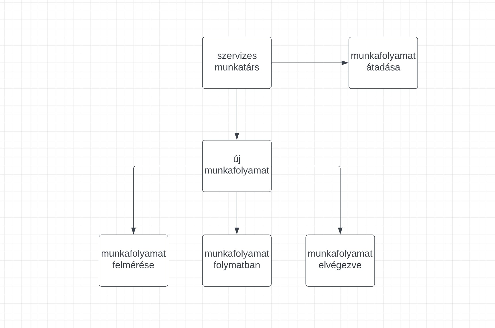

## Rendszerterv

1. #### A rendszer célja
   0. Az informatikai rendszerünk célja, hogy a felhasználók, a korábbi megoldásokkal ellentétben, sokkal könnyebben végezze el a munkafolyamatok vezetését. Fontos szempont, hogy a kezelőfelület egyszerű, letisztult legyen. A webes alkalmazásban egyféle szerepkör van, a feladat amire hivatott nem igényel bonyolultabb rétegeket. A felület elérhető minden eszközről, ami képes internet elérésre. Az adatokat amikre szükség van az alkalmazáshoz, a felhasználó eszközén tároljuk.

2. #### Projektterv
**Projektszerepkörök, felelőségek:**

Scrum master: Nekem Mindegy csapata

Product owner: Nekem Mindegy csapata

**Projektmunkások és felelőségek:**

Backend munkálatok, Frontend munkálatok: Nekem mindegy csapata

Feladatuk, a fronted igényes és felhasználóbarát megalkotása, valamint a rendszer funkcióinak létrehozása, és a webes felület zökkenőmentes működésének biztosítása.

**Ütemterv:**

|**Funkció / Story**|**Feladat / Task**|
| :- | :- |
|Követelmény specifikáció|
köv.spec. elkészítése

|
|Funkcionális specifikáció|funkc.spec elkészítése|
|Rendszerterv|rendszerterv írása|
|Funkciók létrehozása|Működőképessé tenni a frontend felületet|
|Kezelőfelölet Design|Felhasználó barát felület|

3. #### Üzleti folyamatok modellje
#### Az alábbi modellen, azt láthatjuk ahogyan a működési folyamatok zajlanak a bicikli szervízben. A szervizes kollega kezeli a munkafolyamatok jelenlegi állapotát. A folyamatok nyomon követhetőek a többi munkatárs számára is.

4. #### Funkcionális Követelmények
- Munkafolyamatok tárolása
- Munkafolyamatok állapotának vezetése
- Webes felületen való elérés mobil és tablet eszközön.

Nem funkcionális követelmények:

- A program nem tárol semmilyen felhasználói adatot, csupán a munkafolyamatok állapotát és nevét.

5. #### Funkcionális terv
#### **Rendszerszereplők**:   Szervizes munkatárs
**Rendszerhasználati esetek és lefutásaik:**

Szervizes kollega:

0. Feljegyezheti a legújabb munkafolyamatot a listára
0. nyomon követheti a munkafolyamatokat
0. módosíthat a munkafolyamatok jelenlegi állapotán
0. törölhet munkafolyamatokat

**Menü-hierarchiák:**

0. Főmenü

   0. Új munkafolyamat feljegyzése
   0. munkafolyamat stádiumának módosítása
   0. munkafolyamatok listája
   0. munkafolyamat törlése

