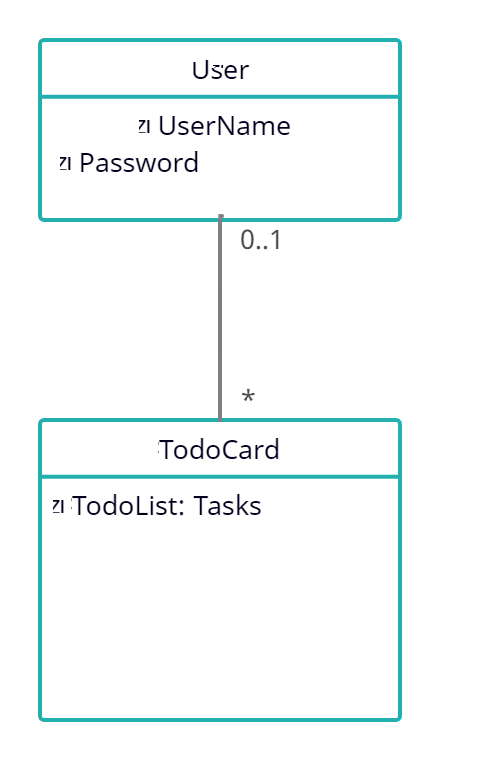

## Rendszerterv

1. #### A rendszer célja
    Az informatikai rendszerünk célja, hogy a felhasználó, a korábbi megoldásokkal ellentétben, sokkal könnyebben végezze el a munkafolyamatok vezetését. A **Yoshihiro kft.** hagyományos biciklik elektromos biciklivé való átalakításával foglalkozik. A cégnél dolgozó munkatársaknak szüksége van egy bárhonnan elérhető weboldalra, amelyen a munka folyamatokat vezetni tudják, illetve az adott munkafolyamatok állapotát tudják szerkeszteni és új munkafolyamatokat létrehozni a rendszerben. Fontos szempont, hogy a kezelőfelület egyszerű, letisztult legyen. A webes alkalmazásban egyféle szerepkör van, a feladat amire hivatott nem igényel bonyolultabb rétegeket. A felület elérhető minden eszközről, ami képes internet elérésre. Az adatokat amikre szükség van az alkalmazáshoz, a felhasználó eszközén tároljuk.

2. #### Projektterv
    **Projektszerepkörök, felelőségek:**

        Scrum master: Nekem Mindegy csapata

        Product owner: Nekem Mindegy csapata

    **Projektmunkások és felelőségek:**

        Backend munkálatok, Frontend munkálatok: Nekem mindegy csapata

        Feladatuk, a fronted igényes és felhasználóbarát megalkotása, valamint a rendszer funkcióinak létrehozása, és a webes felület zökkenőmentes működésének biztosítása.

    **Ütemterv:**

    |**Funkció / Story**|**Feladat / Task**|
    | :- | :- |
    |Követelmény specifikáció|
köv.spec. elkészítése

|
    |Funkcionális specifikáció|funkc.spec elkészítése|
    |Rendszerterv|rendszerterv írása|
    |Funkciók létrehozása|Működőképessé tenni a frontend felületet|
    |Kezelőfelölet Design|Felhasználó barát felület|

3. #### Üzleti folyamatok modellje
    #### Az alábbi modellen, azt láthatjuk ahogyan a működési folyamatok zajlanak a bicikli szervízben. A szervizes kollega kezeli a munkafolyamatok jelenlegi állapotát. A folyamatok nyomon követhetőek a többi munkatárs számára is.

4. #### Funkcionális Követelmények
        - Munkafolyamatok tárolása
        - Munkafolyamatok állapotának vezetése
        - Webes felületen való elérés mobil és tablet eszközön.

    Nem funkcionális követelmények:

        - A program nem tárol semmilyen felhasználói adatot, csupán a munkafolyamatok állapotát és nevét.

5. #### Funkcionális terv
    #### **Rendszerszereplők**:   Szervizes munkatárs
    **Rendszerhasználati esetek:**

    Szervizes kollega:

        1. Feljegyezheti a legújabb munkafolyamatot a listára
        2. nyomon követheti a munkafolyamatokat
        3. módosíthat a munkafolyamatok jelenlegi állapotán
        4. törölhet munkafolyamatokat

    **Menü-hierarchiák:**

        1. Főmenü
        2. Új munkafolyamat feljegyzése
        3. munkafolyamat stádiumának módosítása
        4. munkafolyamatok listája
        5. munkafolyamat törlése

6. #### Fizikai környezet
        •	A program web platformra készül, elérhető lesz bármilyen eszközön, ami lépes webböngésző futtatására.
        •	Nincsenek megvásárolt komponenseink
        •	Fejlesztői eszközök:
            o	Visual Studio Code

7. #### Absztract domain modell
    #### Az alábbi modell az absztrakt komponenseket és ezekk kapcsolatait írja le.
    

8. #### Architekturális terv
        •	A program JavaScript segítségével biztosít login felületet, ahol a felhasználó bejelentkezhet.

9. #### Implementációs terv
        •	A program főként HTML, CSS, és JavaScript nyelveken fog készülni. 
        Ezeket a technológiákat amennyire csak lehet külön fájlokba írva készítjük, 
        és úgy fogjuk egymáshoz kapcsolni a jobb átláthatóság, 
        könnyebb változtathatóság, és könnyebb bővítés érdekében. 

10. #### Tesztterv
        1.	Alfa teszt:
            o	A teszt célja: a meglévő funkciókat különböző böngészőkben teszteljük. A tesztet a fejlesztők végzik. Ez a folyamat sikeres, ha különböző böngészőkben megfelelően működnek a különböző funkciók.
        2. Béta teszt:
                o	Ezt a tesztet nem a fejlesztők végzik.
                o	Tesztelendő böngészők: Google Chrome, Safari, Firefox
                o	Tesztelendő kijelző méretek: 1280x720, 1366x768, 1920x1080

            •	A tesztelés alatt a tesztelő felhasználók visszajelzéseket küldhetnek a fejlesztőknek hiba fellépése esetén.
            •	Ha hiba lép fel, a fejlesztők kijavítják a lehető leggyorsabban.
        3. Tesztelendő funkciók: 
            o	Login felület:
                	•	A login felület elrendezésének ellenőrzése: A weblap megnyitásánál egy üdvözlő felület jelenik meg, 
                    ahol a Bejelentkezés gombra kattintva kell átirányítania a bejelentkező felületre. 
                    A képernyőterveknek megfelelően kell kinéznie. A bejelentkező felületen a felhasználónév és jelszó 
                    beírása után a bejelentkezés gombra kattintva át kell, hogy irányítson a főoldalra.

11. #### Telepítési terv

        A webes felülethez csak egy böngésző telepítése szükséges, külön szoftver nem kell hozzá. A webszerverre közvetlenül az internetről kapcsolódnak rá a kliensek.

12. #### Karbantartási terv

        A webes felület folyamatos karbantartása illetve üzemeltetése, ami hibák elhárítását, igényeknek megfelelően módosítások végzése. Ellenőrizni kell a frissítések utáni esetleges hibákat, illetve szélesíteni a képernyő felbontás kompatibilitást a különböző eszközökre (tablet, telefon). Igénynek megfelelően a szerver mennyiség növelése illetve karbantartása. 

    **Karbantartás:**

        - Corrective Maintenance: A felhasználók által felfedezett hibák kijavítása.
        - Adaptive Maintenance: A program naprakészen tartása és finomhangolása.
        - Perfective Maintenance: A webes felület hosszútávú használata érdekében végzett módosítások, illetve a webes felület teljesítményének és működési megbízhatóságának javítása.
        - Preventive Maintenance: Olyan problémák elhárítása, amelyek még nem tűnnek fontosnak, de később komoly problémákat okozhatnak.